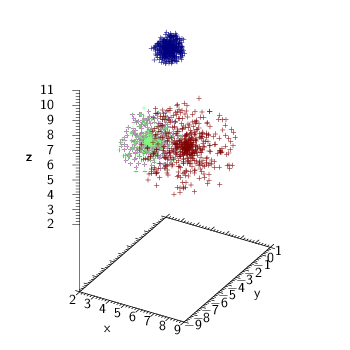
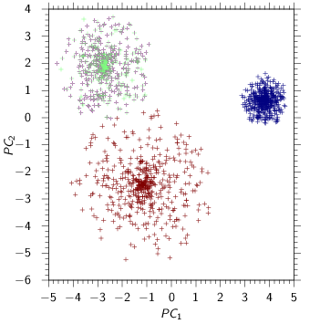
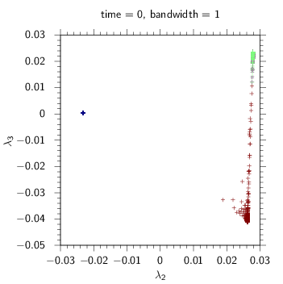
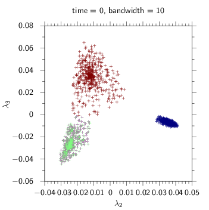
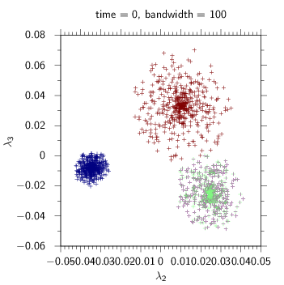
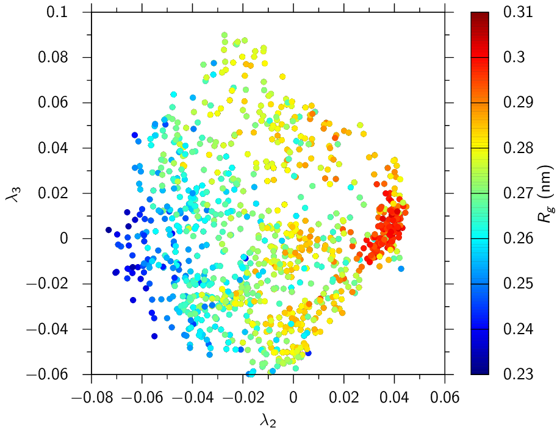

Personal code for principal component analysis and diffusion map
[examples](#examples).  Specifically made to test the idea on some well-known
types of data, but it wouldn't take much to modify the source for use with whatever
data set or distance metric you desire.

## Compilation

    $ make

A library is compiled with the classes needed for the main program and the main
program links to that. The main program requires
[json-fortran](https://github.com/jacobwilliams/json-fortran). LAPACK is
required for the library to calculate the eigenvectors and eigenvalues of
various matrices.

## Running

Modify `dmap.json`. Then do:

    $ ./run dmap.json

You can also run principal component analysis using the following file:

    $ ./run pca.json

`bandwidth.json` is for running the program iteratively over different bandwidth
values. See Figure S1 in [this
document](https://www.pnas.org/cgi/doi/10.1073/pnas.1003293107) for what I was
going for with this. This would more helpful for analyzing simulation data, but
the main program is not set up for that.

## Extras

The `extras` folder contains the source code of two programs to aid in
generating example data sets. No configuration files are provided, so you will
need to edit the source.

## Examples

A few examples using this program.

Compare the swiss roll and punctured sphere results with those found [in this
paper](http://wireilla.com/papers/ijfcst/V4N6/4614ijfcst06.pdf), specifically in
Section 3.1. Note that my value of `bandwidth` is the square of what they
call `sigma` (I am not squaring the denominator of the Gaussian kernel in my
code).

### Cluster of points

Colors indicate where points are in relationship to axis with greatest variance.

#### Original data

#### Principal component analysis

#### Diffusion maps

### Multiple clusters

Colors indicate original cluster.

#### Original data

#### Principal component analysis

#### Diffusion maps

### Swiss roll

Colors indicate where points are in relationship to the center of the swiss
roll.

#### Original data

#### Principal component analysis

#### Diffusion maps

### Punctured sphere

Colors indicate where points are in relationship to axis that goes through the
holes in the sphere.

#### Original data

#### Principal component analysis

#### Diffusion maps

### Simulation of octane in water

The original data is from a Molecular Dynamics simulation I performed of a
single octane in water. I used the RMSD between each pair of simulation
snapshots of the octane as the distance metric for the diffusion map
calculation (1,000 snapshots total). For the principal components analysis I
used the dihedral angles as the metric. The colors indicate the radius of
gyration of the octane. Compare these results with Figure S2.C from [this
paper's SI
(PDF)](http://www.pnas.org/content/suppl/2010/07/14/1003293107.DCSupplemental/pnas.1003293107_SI.pdf).

The branch `alkane` has the modified code that performs these calculations. The
original simulation trajectory is too large to post here. To reproduce the data,
use [this input](examples/octane/prd.tpr) file with GROMACS and run the
simulation. Then use `gmx trjconv` to fit the octane's translational and
rotational motion, saving only the octane's coordinates. Use the output
coordinate file (xtc) as the input for this analysis (by default it will output
10,000 frames, so you may want to reduce this some from the diffusion map
analysis, since it is very memory intensive).

#### Principal component analysis

#### Diffusion map

