Personal code for principal component analysis and diffusion map
[examples](#examples).  Specifically made to test the idea on some well-known
data sets, but it wouldn't take much to modify the source for use with whatever
data set or distance metric you desire.

## Compilation

    $ make

A library is compiled with the classes needed for the main program and the main
program links to that. The main program requires
[json-fortran](https://github.com/jacobwilliams/json-fortran). LAPACK is
required for the library to calculate the eigenvectors and eigenvalues of
various matrices.

## Running

Modify `dmap.json`. Then do:

    $ ./run dmap.json

You can also run principal component analysis using the following file:

    $ ./run pca.json

`bandwidth.json` is for running the program iteratively over different bandwidth
values. See Figure S1 in [this
document](https://www.pnas.org/cgi/doi/10.1073/pnas.1003293107) for what I was
going for with this. This would more helpful for analyzing simulation data, but
the main program is not set up for that.

## Extras

The `extras` folder contains the source code of two programs to aid in
generating example data sets. No configuration files are provided, so you will
need to edit the source.

## Examples

Compare the following results with those found [in this
paper](http://wireilla.com/papers/ijfcst/V4N6/4614ijfcst06.pdf), specifically in
Section 3.1. Note that my value of `bandwidth` is the square of what they
call `sigma` (I am not squaring the denominator of the Gaussian kernel in my
code).

### Cluster of points

Colors indicate where points are in relationship to axis with greatest variance.

#### Original data
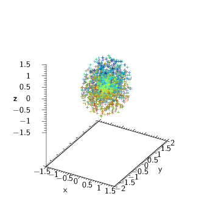

#### Principal component analysis
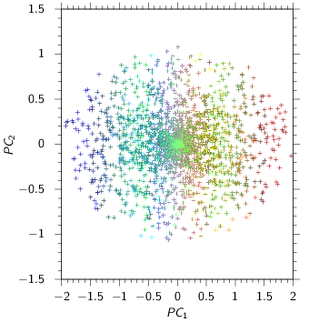

#### Diffusion maps
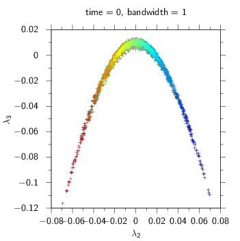
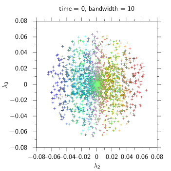
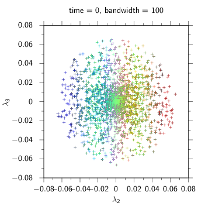

### Swiss roll

Colors indicate where points are in relationship to the center of the swiss
roll.

#### Original data
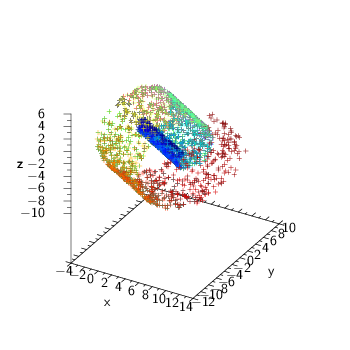

#### Principal component analysis
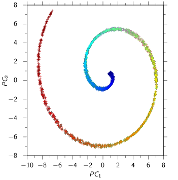

#### Diffusion maps
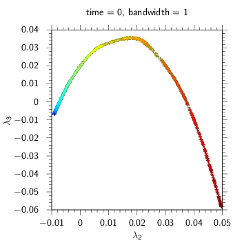
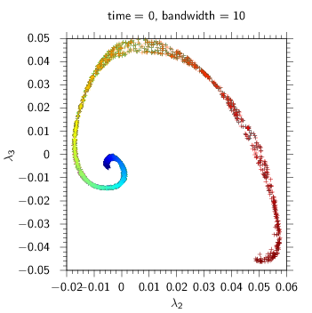
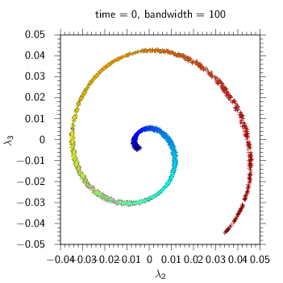

### Punctured sphere

Colors indicate where points are in relationship to axis that goes through the
holes in the sphere.

#### Original data
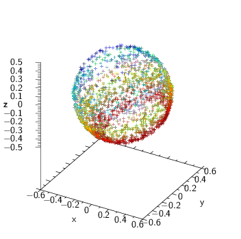

#### Principal component analysis
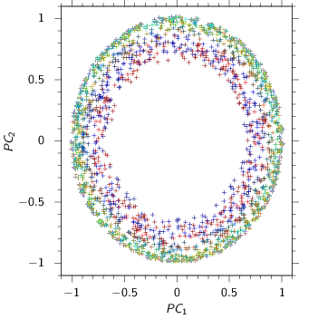

#### Diffusion maps
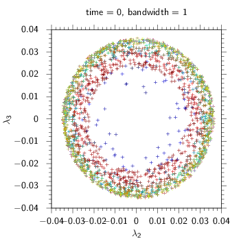
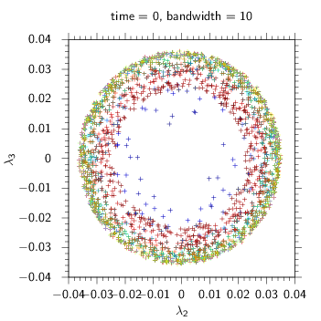
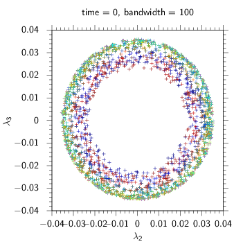

